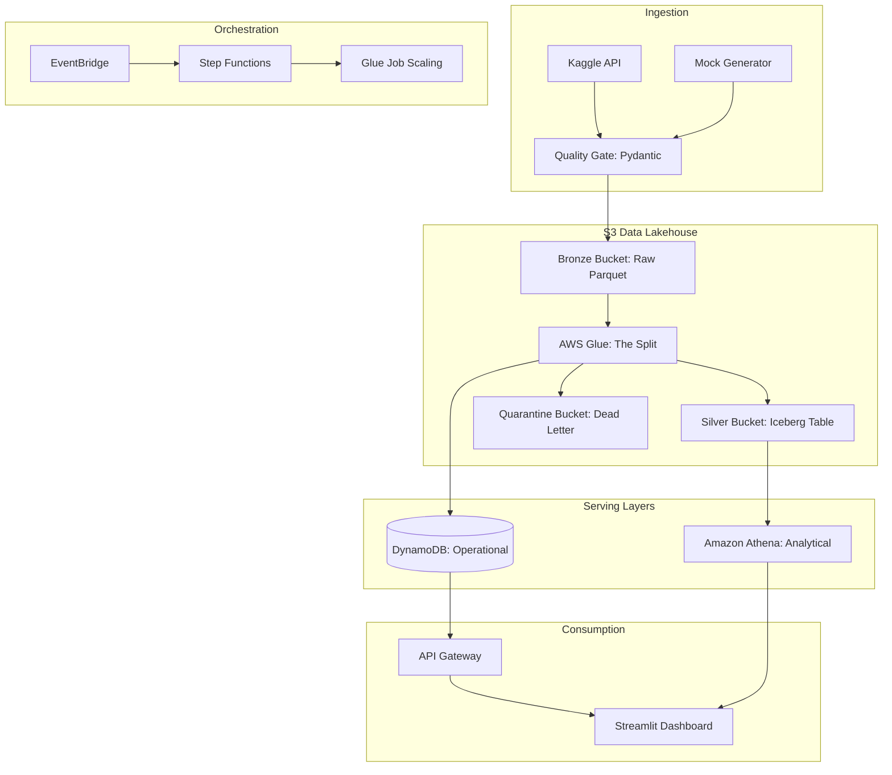

# Norway Car Sales: Dual-Serving Data Lakehouse

A production-ready Data Engineering project demonstrating a modern, serverless **Dual-Serving Architecture**. This project ingests historical automotive sales data from Norway, applies a strict quality gate, and bifurcates the data into an **Analytical Layer** (Apache Iceberg + Athena) and an **Operational Layer** (DynamoDB + API Gateway).

## 🏛 Architecture



## 🛠 Tech Stack

- **Data Ingestion**: Python (Pydantic, Pandas, Kaggle API)
- **Data Processing**: AWS Glue (PySpark), AWS Lambda
- **Analytical Storage**: Amazon S3 (Apache Iceberg format)
- **Operational Storage**: Amazon DynamoDB (NoSQL)
- **Orchestration**: AWS Step Functions, Amazon EventBridge
- **Serving Layer**: Amazon Athena, AWS Lambda, API Gateway
- **IaC**: Terraform
- **Frontend**: Streamlit

## ⚡ Key Features

- **Fail-Fast Quality Gate**: Uses Pydantic to validate data contracts at the entry point. Malformed records are immediately rerouted to a Quarantine Bucket.
- **Dual-Serving Pattern**: Data is optimized for both sub-second API lookups (DynamoDB) and complex historical aggregation (Athena).
- **Scale-and-Save Orchestration**: AWS Step Functions dynamically scales DynamoDB RCUs/WCUs before the batch job and descales them afterwards to maximize AWS Free Tier usage.
- **Modern UI**: An interactive dashboard serving both "Real-time" metrics and historical trends from two different data sources seamlessly.

## 🚀 Getting Started

### Prerequisites

- Python 3.12+
- Terraform 1.0+
- AWS CLI configured with appropriate permissions
- Kaggle API Credentials (`KAGGLE_USERNAME`, `KAGGLE_KEY`)

### Installation

1. **Clone the repository**:
   ```bash
   git clone https://github.com/kajinmo/aws-supplychain-lakehouse.git
   cd aws-supplychain-lakehouse
   ```

2. **Install dependencies**:
   ```bash
   uv sync
   ```

3. **Configure Environment**:
   Create a `.env` file in the root directory:
   ```env
   KAGGLE_USERNAME="your_username"
   KAGGLE_KEY="your_api_key"
   AWS_ACCESS_KEY_ID="your_access_key"
   AWS_SECRET_ACCESS_KEY="your_secret_key"
   BRONZE_BUCKET="your-bronze-bucket-name"
   QUARANTINE_BUCKET="your-quarantine-bucket-name"
   ```

### Initial Deployment & Bootstrap

1. **Provision Infrastructure**:
   ```bash
   cd infra/terraform
   terraform init
   terraform apply
   ```

2. **Load Historical Data (Bootstrap)**:
   This command downloads 10 years of Norwegian car sales history, validates it, and pushes it to your Cloud Bronze layer.
   ```bash
   uv run python scripts/historical_bootstrap.py
   ```

3. **Process the Batch**:
   Go to the AWS Console, find the Step Functions state machine `car-sales-lakehouse-batch-orchestrator`, and start a manual execution to process the bootstrap batch.

4. **Launch Dashboard**:
   ```bash
   uv run streamlit run frontend/app.py
   ```

## 📊 Data Source
Historical car sales data in Norway (2007-2017) sourced from Kaggle: [Norway New Car Sales](https://www.kaggle.com/datasets/lennat/norway-new-car-sales).

---
*Developed as a portfolio project for AWS Data Engineering demonstrating Serverless, NoSQL, and Iceberg best practices.*
