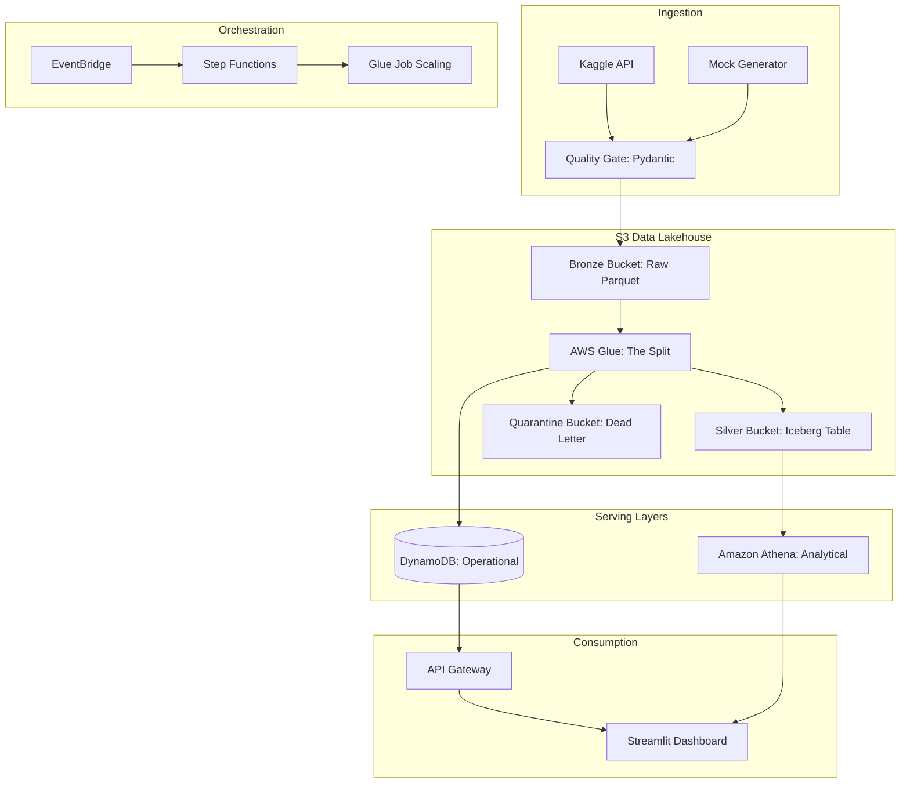

# Norway Car Sales: Dual-Serving Data Lakehouse

A production-ready Data Engineering project demonstrating a modern, serverless **Dual-Serving Architecture**. This project ingests historical automotive sales data from Norway, applies a strict quality gate, and bifurcates the data into an **Analytical Layer** (Apache Iceberg + Athena) and an **Operational Layer** (DynamoDB + API Gateway).

## Architecture


```mermaid
graph TD
    subgraph Ingestion
        K[Kaggle API] --> P[Quality Gate: Pydantic]
        M[Mock Generator] --> P
    end

    subgraph "S3 Data Lakehouse"
        P --> B[Bronze Bucket: Raw Parquet]
        B --> G[AWS Glue: The Split]
        G --> S[Silver Bucket: Iceberg Table]
        G --> Q[Quarantine Bucket: Dead Letter]
    end

    subgraph "Serving Layers"
        G --> D[(DynamoDB: Operational)]
        S --> A[Amazon Athena: Analytical]
    end

    subgraph Consumption
        D --> AG[API Gateway]
        AG --> ST[Streamlit Dashboard]
        A --> ST
    end

    subgraph Orchestration
        EB[EventBridge] --> SF[Step Functions]
        SF --> GL[Glue Job Scaling]
    end
```

## Tech Stack

- **Data Ingestion**: Python (Pydantic, Pandas, Kaggle API)
- **Data Processing**: AWS Glue (PySpark), AWS Lambda
- **Analytical Storage**: Amazon S3 (Apache Iceberg format)
- **Operational Storage**: Amazon DynamoDB (NoSQL)
- **Orchestration**: AWS Step Functions, Amazon EventBridge
- **Serving Layer**: Amazon Athena, AWS Lambda, API Gateway
- **IaC**: Terraform
- **Frontend**: Streamlit

## Key Features

- **Fail-Fast Quality Gate**: Uses Pydantic to validate data contracts at the entry point. Malformed records are immediately rerouted to a Quarantine Bucket.
- **Dual-Serving Pattern**: Data is optimized for both sub-second API lookups (DynamoDB) and complex historical aggregation (Athena).
- **Scale-and-Save Orchestration**: AWS Step Functions dynamically scales DynamoDB RCUs/WCUs before the batch job and descales them afterwards to maximize AWS Free Tier usage.
- **Modern UI**: An interactive dashboard serving both "Real-time" metrics and historical trends from two different data sources seamlessly.

## Getting Started

### Prerequisites

- Python 3.12+
- Terraform 1.0+
- AWS CLI configured with appropriate permissions
- Kaggle API Credentials (`KAGGLE_USERNAME`, `KAGGLE_KEY`)

### Installation

1. **Clone the repository**:
   ```bash
   git clone https://github.com/kajinmo/aws-supplychain-lakehouse.git
   cd aws-supplychain-lakehouse
   ```

2. **Install dependencies**:
   ```bash
   uv sync
   ```

3. **Configure Environment**:
   Create a `.env` file in the root directory:
   ```env
   KAGGLE_USERNAME="your_username"
   KAGGLE_KEY="your_api_key"
   AWS_ACCESS_KEY_ID="your_access_key"
   AWS_SECRET_ACCESS_KEY="your_secret_key"
   BRONZE_BUCKET="your-bronze-bucket-name"
   QUARANTINE_BUCKET="your-quarantine-bucket-name"
   ```

### Initial Deployment & Bootstrap

1. **Provision Infrastructure**:
   Before initializing, ensure you manually create the S3 bucket intended for the Terraform remote state (as defined in `infra/terraform/backend_infra.tf`) and set up your Budget Alert email.

   ```bash
   # 1. Create the remote state bucket
   aws s3 mb s3://<your-tfstate-bucket-name> --region us-east-1

   # 2. Set the mandatory budget alert variable
   export TF_VAR_budget_alert_email="your_email@example.com"
   # Note: Use $env:TF_VAR_budget_alert_email="email@example.com" on PowerShell

   # 3. Provision resources
   cd infra/terraform
   terraform init
   terraform import aws_s3_bucket.terraform_state <your-tfstate-bucket-name>
   terraform apply
   ```

2. **Load Historical Data (Bootstrap)**:
   This command downloads 10 years of Norwegian car sales history, validates it, and pushes it to your Cloud Bronze layer.
   ```bash
   uv run python scripts/historical_bootstrap.py
   ```

3. **Inject Mock Data (Incremental Testing)**:
   To simulate continuous daily ingestion, you can manually inject small batches of mock data. Add `--chaos` to intentionally generate bad records for testing the Quarantine bucket observability.
   ```bash
   uv run python src/extract/run_pipeline.py --mock --chaos
   ```

4. **Process the Batch**:
   Go to the AWS Console, find the Step Functions state machine `car-sales-lakehouse-batch-orchestrator`, and start a manual execution to process the data in your Bronze bucket. Wait for it to complete.

5. **Deploy Analytical Views (Gold Layer)**:
   Once the batch is processed, run this script to create the logical views for the Athena Analytics dashboard.
   ```bash
   uv run python scripts/deploy_gold_views.py
   ```

6. **Launch Dashboard**:
   ```bash
   uv run streamlit run frontend/app.py
   ```

## Architecture Decisions: Scheduled Batch vs. Event-Driven

Although it is possible to configure **S3 Event Notifications** to trigger the Step Functions orchestrator the exact moment a new file hits the Bronze bucket, this project intentionally uses a **Scheduled Batch approach**. 

* **The "Small Files Problem" & Cost Control**: If upstream systems send data in small, frequent intervals (e.g., thousands of 10kb files), triggering an Event-Driven AWS Glue job (Apache Spark) for each micro-file would cause massive DPU overhead and skyrocket the AWS bill.
* **The Batch Solution**: By accumulating raw files in the Bronze layer and running a scheduled batch orchestrator daily/hourly, we achieve massive cost savings (staying well within the AWS Free Tier) while maximizing the distributed processing efficiency of Spark.

## Data Source
Historical car sales data in Norway (2007-2017) sourced from Kaggle: [Norway New Car Sales](https://www.kaggle.com/datasets/lennat/norway-new-car-sales).

---
*Developed as a portfolio project for AWS Data Engineering demonstrating Serverless, NoSQL, and Iceberg best practices.*
